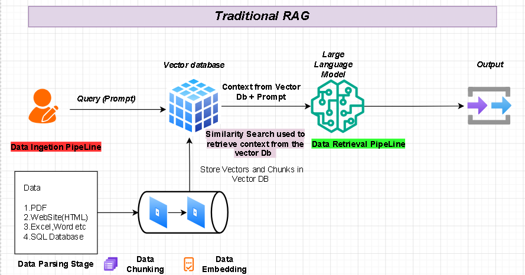
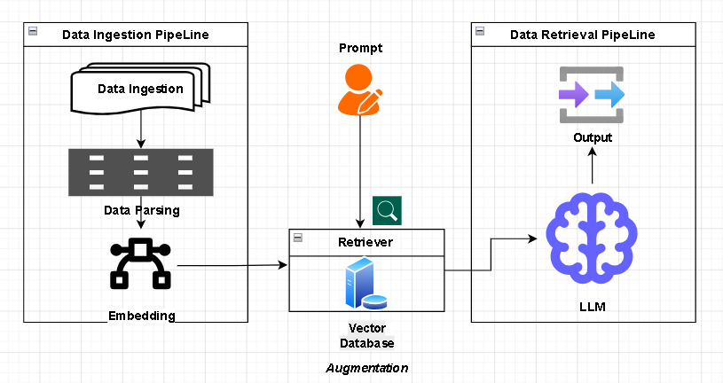
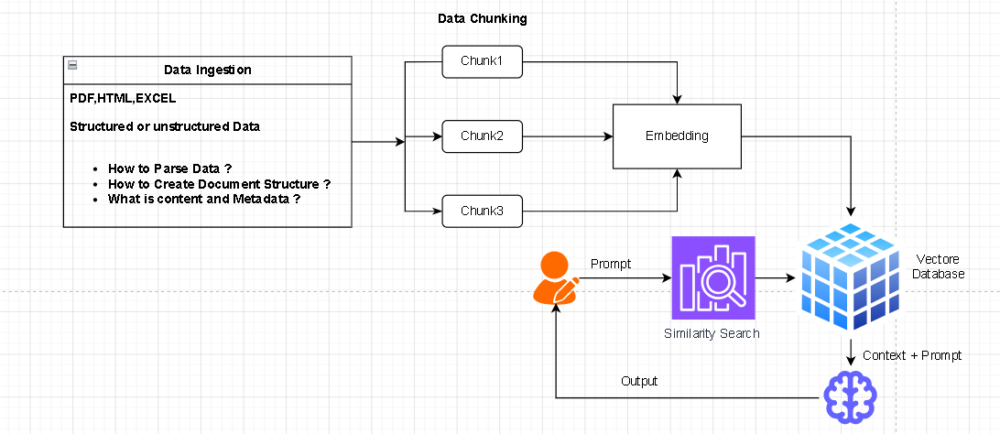
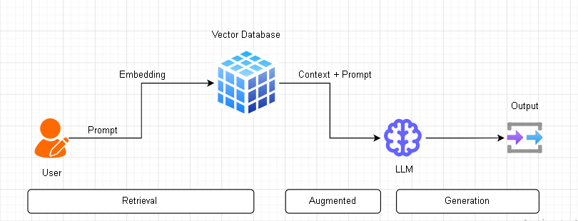

# 🤖 What is RAG? (Retrieval-Augmented Generation)

Imagine you have a very smart friend who has read almost every book in the world.

This friend is like a **Large Language Model (LLM)** — great at answering questions and telling stories.  
But sometimes:
- They forget details  
- They don’t know recent events  
- Their knowledge may be outdated  

👉 **RAG is like giving that smart friend a library card and a magnifying glass.**

---

## ⚙️ How It Works (Simple Explanation)

Instead of guessing answers from memory, RAG follows **three simple steps**:

### 🔍 1. Look It Up (Retrieval)
The system searches through a collection of trusted data (like a folder of expert knowledge).

### 📖 2. Check the Facts
It finds the exact information that matches the question.

### 💡 3. Generate the Answer
It uses those facts to produce a **clear, accurate, and up-to-date response**.

---

## 🚀 Why is RAG So Powerful?

| Feature         | Why It’s Helpful |
|----------------|------------------|
| 🎯 Super Accuracy | Reduces hallucinations by using real data |
| 🕒 Fresh Info     | Can include recent updates without retraining |
| 🔒 Privacy        | Works with your private data securely |
| 💰 Cost Saving    | Avoids expensive retraining of models |

---

## 🧠 The Bottom Line

> ✅ RAG makes AI smarter by teaching it to **verify information from trusted sources before answering**.

---

## 📌 In One Line

**RAG = Search + Verify + Answer**


# 🤖 Simple Generative AI Application

A basic Generative AI application works like this: 

User Prompt → LLM (Large Language Model) → Output


### 📌 Example
You ask:
> “What is Python?”

👉 The AI processes your question and gives you an answer.

---

## ⚠️ Problems with Simple LLM Applications

### 1. 🕒 Limited Knowledge (Cutoff Date Problem)

LLMs are trained only on data available up to a specific time, called the **cutoff date**.

#### ❗ What this means:
- They know information only up to that point  
- They don’t know recent news or updates  
- They may miss current events  

#### 📌 Example:
If something important happened yesterday, the LLM may not know it.

👉 Because of this, the model may generate answers that **sound correct but are actually wrong**.  
This is called **hallucination**.

---

### 2. 💸 Updating Knowledge is Expensive

To teach new information, you usually need to:
- Retrain the model, or  
- Fine-tune it again  

#### ❗ Problems:
- Takes a lot of time  
- Very expensive  
- Requires huge computing power  
- LLMs have billions of parameters  

---

## 💡 Solution: RAG (Retrieval-Augmented Generation)

Instead of retraining again and again, we use **RAG**.

👉 RAG allows the AI to access **external knowledge sources**, such as:
- 📄 Documents  
- 🗄️ Databases  
- 🌐 Websites  
- 📑 PDFs  

---

## 🔄 How RAG Works

User Query → Search Relevant Data (Vector Database) → Send Data + Query to LLM → Better Output

---

## 🚀 Benefits of RAG

- ✅ Access to latest information  
- ✅ Reduces hallucination  
- ✅ No need for frequent retraining  
- ✅ Saves cost and time  

---

## 🧠 In Simple Words

- **Simple LLM** → Answers only from memory  
- **RAG** → Answers from memory + external knowledge  

---

## 🎯 Final Thought

> RAG makes AI more powerful by combining **intelligence + real-time information**.





<!-- <iframe src="D:\RAG Pipeline\TraditionalRAG.html" width="100%" height="600"></iframe> -->

# 📘 Document Processing & AI Basics (Simple Guide)

---

## 🧩 Step 1: Understand the Document Structure

Before using any document (PDF, Word, Excel, etc.), we need to understand how the data is organized.

### A document may contain:
- Title  
- Headings  
- Paragraphs  
- Tables  
- Images  

### 📌 Example:

A PDF file about Python may look like:

- **Title:** Python Basics  
- **Heading 1:** Introduction  
- **Paragraph:** “Python is a programming language…”  
- **Heading 2:** Features  
- **Content:** Bullet points  

👉 Understanding this structure helps us process the document correctly.

---

## 🔍 Step 2: Data Parsing and Creating Structure

**Parsing** means extracting useful data from the document and organizing it properly.

We convert **unstructured data → structured format**.

### 📌 Example:

**Input Text:** **Python is easy. It is used in AI.**

**Structured Output:**
```json
{
  "topic": "Python",
  "points": [
    "Python is easy",
    "Used in AI"
  ]
}
```

👉 This makes it easier for AI to read and understand the data.

## ✂️ Step 3: What is Chunking? Why is it Needed?

### ✅ What is Chunking?
Chunking means breaking large text into smaller parts (**chunks**).

### ❓ Why Chunking is Needed?
LLMs cannot read very large text at once because they have a **fixed context size (memory limit)**.

### 📌 Fixed Context Size:
An LLM can only process a limited number of words/tokens at a time.

### 📌 Example:

**Large document:**
- 100-page PDF  

**Converted into chunks:**
- Chunk 1: Page 1–2  
- Chunk 2: Page 3–4  
- Chunk 3: Page 5–6  

👉 Now the AI can process each chunk easily.

### 🧠 Simple Analogy:
- You can’t eat a full meal in one bite  
- You take small bites (**chunks**)  

---

## 🔢 Step 4: What is Embedding?

Embedding means converting text into numbers so that machines can understand it.

👉 AI cannot understand text directly, it understands **numbers**.

### 📌 Example:

**Text:** I love Python

**Embedding (numbers):** [0.12, -0.45, 0.78, …]

👉 These numbers represent the meaning of the sentence.

### ⭐ Important:
Similar sentences will have **similar embeddings**.

**Example:**
- “I love Python”  
- “Python is my favorite”  

👉 Their embeddings will be close to each other.

---

## 📊 Step 5: What is Vector and Vector Database?

### 🔹 What is a Vector?
A vector is just a list of numbers (from embeddings).

**Example:** [0.12, -0.45, 0.78]

👉 This represents the meaning of a sentence.

---

### 🗄️ What is a Vector Database?
A **Vector DB** stores these vectors and helps find similar data quickly.

### 📌 Example:

**Stored data:**
- “Python is easy”  
- “Java is powerful”  
- “AI uses Python”  

### 🧠 When user asks: Which language is used in AI?

### 🔄 System Process:
1. Convert question into vector  
2. Search similar vectors in DB  
3. Find best match → “AI uses Python”  
4. Return correct answer  

---

## 🔄 Final Simple Flow

1. Understand document  
2. Parse and structure data  
3. Break into chunks  
4. Convert chunks into embeddings (vectors)  
5. Store in vector database  
6. Search and get best answer  

---

## 🧾 One-Line Summary

> We break documents into small pieces, convert them into numbers, store them, and find the best match when a question is asked.




