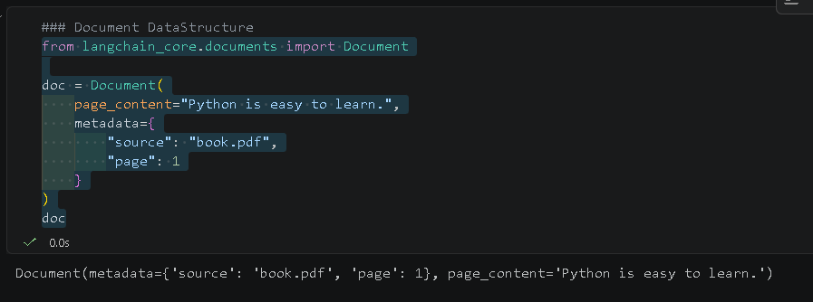
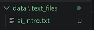
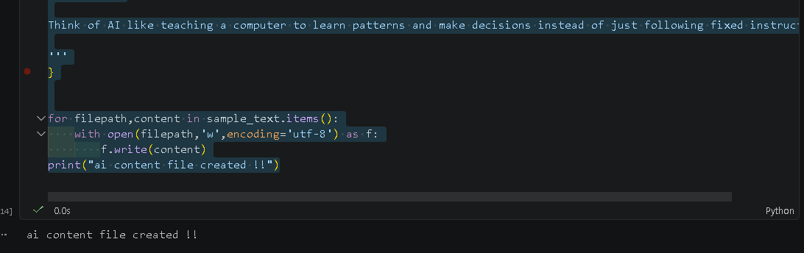

## 📄 LangChain Document Data Structure 
```bash
https://docs.langchain.com/oss/python/integrations/document_loaders

```
### 🔹 What is a Document in LangChain?
##### In LangChain, a Document is the basic unit of data used for processing text.

**Think of it like this:**

##### 👉 A Document = Content + Extra Information

### 🔹 Structure of a Document

##### A LangChain document mainly has 2 important parts:

- Page Content

**This is the actual text data.**

#### Example:
```bash
"Python is a popular programming language."
```
- Metadata

**This is extra information about the content.**

#### Example:
```json
{
  "source": "python_book.pdf",
  "page": 5,
  "author": "John Doe"
}
```
### 🔹 Full Example of a Document
```bash
### Document DataStructure
from langchain_core.documents import Document
### added page_content and metadata manually to document.This meta data is very important when you are doing similarity search .

### you can use meta data as filter like, give me python definition from @ specific author
doc = Document(
    page_content="Python is easy to learn.",
    metadata={
        "source": "book.pdf",
        "page": 1,
        "author":'Goutam Bhat'
    }
)
doc
```
#### OutPut

#### Create folder using python 
```bash
## create a simple txt file
import os
os.makedirs("../data/text_files",exist_ok=True) #used to create folder exist_ok=True mean if folder exist dont do any thing

## create ai_intro.txt file and add a content
sample_text={
    "../data/text_files/ai_intro.txt":'''
AI (Artificial Intelligence) is a field of computer science that focuses on creating machines or software that can perform tasks that normally require human intelligence.

In simple terms, AI is about making computers “think” or “act smart.”

What can AI do?

AI systems can:

Understand language (like chatbots)
Recognize images and faces
Make decisions or predictions
Learn from experience (this is called machine learning)
Examples of AI in everyday life
Voice assistants like Siri or Google Assistant
Recommendation systems on Netflix or YouTube
Self-driving features in cars
Spam filters in email
Types of AI
Narrow AI: Designed for specific tasks (most AI today)
General AI: A theoretical system that could do any intellectual task a human can
Simple idea

Think of AI like teaching a computer to learn patterns and make decisions instead of just following fixed instructions.

'''
}

for filepath,content in sample_text.items():
    with open(filepath,'w',encoding='utf-8') as f:
        f.write(content)
print("ai content file created !!")
```
#### output



### Document to Document Structure [TXT file loader]

```bash
### how to read file content from text loader 

from langchain_community.document_loaders import TextLoader

loader=TextLoader("../data/text_files/ai_intro.txt",encoding='utf-8')
document=loader.load()
print(document)
```
**output**
```bash
[Document(metadata={'source': '../data/text_files/ai_intro.txt'}, page_content='\nAI (Artificial Intelligence) is a field of computer science that focuses on creating machines or software that can perform tasks that normally require human intelligence.\n\nIn simple terms, AI is about making computers “think” or “act smart.”\n\nWhat can AI do?\n\nAI systems can:\n\nUnderstand language (like chatbots)\nRecognize images and faces\nMake decisions or predictions\nLearn from experience (this is called machine learning)\nExamples of AI in everyday life\nVoice assistants like Siri or Google Assistant\nRecommendation systems on Netflix or YouTube\nSelf-driving features in cars\nSpam filters in email\nTypes of AI\nNarrow AI: Designed for specific tasks (most AI today)\nGeneral AI: A theoretical system that could do any intellectual task a human can\nSimple idea\n\nThink of AI like teaching a computer to learn patterns and make decisions instead of just following fixed instructions.\n\n')]
```
### How to read multiple files at once ?
```bash
### directory loader 
from langchain_community.document_loaders import DirectoryLoader

dir_loader=DirectoryLoader("../data/text_files",
                           glob="**/*.txt", #regex pattern to detect files from folder
                           loader_cls=TextLoader, #loader class to load txt file if you want pdf you can change types
                           loader_kwargs={'encoding':'utf-8'},
                           show_progress=False) # if you want load progress you need to mark it as true and install ** pip install tqdm ** library

documents=dir_loader.load()
print(documents)
```
**output**
```bash
[Document(metadata={'source': '..\\data\\text_files\\ai_intro.txt'}, page_content='\nAI (Artificial Intelligence) is a field of computer science that focuses on creating machines or software that can perform tasks that normally require human intelligence.\n\nIn simple terms, AI is about making computers “think” or “act smart.”\n\nWhat can AI do?\n\nAI systems can:\n\nUnderstand language (like chatbots)\nRecognize images and faces\nMake decisions or predictions\nLearn from experience (this is called machine learning)\nExamples of AI in everyday life\nVoice assistants like Siri or Google Assistant\nRecommendation systems on Netflix or YouTube\nSelf-driving features in cars\nSpam filters in email\nTypes of AI\nNarrow AI: Designed for specific tasks (most AI today)\nGeneral AI: A theoretical system that could do any intellectual task a human can\nSimple idea\n\nThink of AI like teaching a computer to learn patterns and make decisions instead of just following fixed instructions.\n\n'), 
Document(metadata={'source': '..\\data\\text_files\\hello.txt'}, page_content='')]

```

### PDF Loader 

```bash 
##PDF Loader 
from langchain_community.document_loaders import PyPDFLoader,PyMuPDFLoader

dir_loader=DirectoryLoader("../data/PDF",
                           glob="**/*.pdf",
                           loader_cls=PyMuPDFLoader,# you can also use PyPDFLoader
                           show_progress=False)

pdf_documents=dir_loader.load()

print(pdf_documents[0].metadata) # Load Meta data 
print(pdf_documents[0].page_content) # Load Page content
```

```bash
[Document(metadata={'producer': 'PDF Annotator 7.0.0.702 [Debenu Quick PDF Library 12.12 (www.debenu.com)]', 'creator': 'Adobe Illustrator CS5.1', 'creationdate': '2013-05-08T11:16:37-07:00', 'source': '..\\data\\PDF\\atlassian_git_cheatsheet.pdf', 'file_path': '..\\data\\PDF\\atlassian_git_cheatsheet.pdf', 'total_pages': 7, 'format': 'PDF 1.5', 'title': 'atlassian_git_cheatsheet', 'author': '', 'subject': '', 'keywords': '', 'moddate': '2018-10-02T15:09:33-05:00', 'trapped': '', 'modDate': "D:20181002150933-05'00'", 'creationDate': "D:20130508111637-07'00'", 'page': 0}, page_content='Git Basics\nUndoing Changes\ngit init \n<directory>\ngit clone <repo>\ngit config \nuser.name <name>\ngit add \n<directory>\ngit commit -m \n"<message>"\ngit status\ngit log\ngit diff\nCreate empty Git repo in specified directory. Run with no arguments to \ninitialize the current directory as a git repository. \nClone repo located at <repo> onto local machine.  Original repo can be \nlocated on the local filesystem or on a remote machine via HTTP or SSH. \nDefine author name to be used for all commits in current repo. Devs \ncommonly use --global flag to set config options for current user. \nStage all changes in <directory> for the next commit. Replace <directory> \nwith a <file> to change a specific file.\nCommit the staged snapshot, but instead of launching a text editor, use \n<message> as the commit message.\nList which files are staged, unstaged, and untracked.\nDisplay the entire commit history using the default format. For \ncustomization see additional options.\nShow unstaged changes between your index and working \ndirectory\nCreate new commit that undoes all of the changes made in \n<commit>, then apply it to the current branch.\ngit revert \n<commit>\nRemove <file> from the staging area, but leave the working directory \nunchanged. This unstages a file without overwriting any changes.\ngit reset <file>\nShows which files would be removed from working directory. Use the -f \nflag in place of the -n flag to execute the clean.\ngit clean -n\n+\nGit Branches\nRemote Repositories\nRewriting Git History\nReplace the last commit with the staged changes and last commit \ncombined. Use with nothing staged to edit the last commit’s message. \ngit commit --amend\nRebase the current branch onto <base>. <base> can be a commit \nID, a branch name, a tag, or a relative reference to HEAD.\ngit rebase <base>\nShow a log of changes to the local repository\'s HEAD. Add --relative-\ndate flag to show date info or --all to show all refs.\ngit reflog\nList all of the branches in your repo. Add a <branch> argument to \ncreate a new branch with the name <branch>.\ngit branch\nCreate and check out a new branch named <branch>. Drop the -b \nflag to checkout an existing branch.\ngit checkout -b \n<branch>\nMerge <branch> into the current branch. \ngit merge <branch>\nCreate a new connection to a remote repo. After adding a remote, you \ncan use <name> as a shortcut for <url> in other commands.\ngit remote add \n<name> <url>\nFetches a specific <branch>, from the repo. Leave off <branch> to \nfetch all remote refs. \ngit fetch \n<remote> <branch>\nFetch the specified remote’s copy of current branch and immediately \nmerge it into the local copy. \ngit pull <remote>\nPush the branch to <remote>, along with necessary commits and \nobjects. Creates named branch in the remote repo if it doesn’t exist.\ngit push <remote> \n<branch>\nGit Cheat Sheet\nVisit atlassian.com/git for more information, training, and tutorials\npage 1\n+\n+\n+\n+\n+\n+\n+'), Document(metadata={'producer': 'PDF Annotator 7.0.0.702 [Debenu Quick PDF Library 12.12 (www.debenu.com)]', 'creator': 'Adobe Illustrator CS5.1', 'creationdate': '2013-05-08T11:16:37-07:00', 'source': '..\\data\\PDF\\atlassian_git_cheatsheet.pdf', 'file_path': '..\\data\\PDF\\atlassian_git_cheatsheet.pdf', 'total_pages': 7, 'format': 'PDF 1.5', 'title': 'atlassian_git_cheatsheet', 'author': '', 'subject': '', 'keywords': '', 'moddate': '2018-10-02T15:09:33-05:00', 'trapped': '', 'modDate': "D:20181002150933-05'00'", 'creationDate': "D:20130508111637-07'00'", 'page': 1}, page_content='git config\ngit diff\ngit log\ngit reset\ngit rebase\ngit pull\ngit push\nAdditional Options +\nDefine the author name to be used for all commits by the current user.\ngit config --global \nuser.name <name>\nDefine the author email to be used for all commits by the current user.\ngit config --global \nuser.email <email>\nCreate shortcut for a Git command. E.g. alias.glog "log --graph \n--oneline" will set "git glog" equivalent to "git log --graph --oneline"\ngit config --global \nalias.<alias-name> \n<git-command>\nSet text editor used by commands for all users on the machine. <editor> \narg should be the command that launches the desired editor (e.g., vi).\ngit config --system \ncore.editor \n<editor>\nOpen the global configuration file in a text editor for manual editing.\ngit config --global \n--edit\ngit log -<limit>\ngit log --oneline\ngit log --stat\ngit log -p\ngit log \n--author="<pattern>"\ngit log \n--grep="<pattern>"\ngit log \n<since>..<until>\ngit log -- <file>\ngit log --graph \n--decorate\nLimit number of commits by <limit> .  E.g. "git log -5" will limit to 5 \ncommits\nCondense each commit to a single line.\nInclude which files were altered and the relative number of lines that \nwere added or deleted from each of them.\nDisplay the full diff of each commit.\nSearch for commits by a particular author. \nSearch for commits with a commit message that matches \n<pattern>. \nShow commits that occur between <since> and <until>. Args can be a \ncommit ID, branch name, HEAD, or any other kind of revision reference.\nShow difference between working directory and last commit.\nOnly display commits that have the specified file. \n--graph flag draws a text based graph of commits on left side of commit \nmsgs. --decorate adds names of branches or tags of commits shown.\ngit diff HEAD\nShow difference between staged changes and last commit.\ngit diff --cached\nReset staging area to match most recent commit, but leave the working \ndirectory unchanged. \ngit reset\nReset staging area and working directory to match most recent commit \nand overwrites all changes in the working directory.\ngit reset --hard\nMove the current branch tip backward to <commit>, reset the staging \narea to match, but leave the working directory alone. \ngit reset <commit>\nSame as previous, but resets both the staging area & working directory to \nmatch. Deletes uncommitted changes, and all commits after <commit>.\ngit reset --hard \n<commit>\nInteractively rebase current branch onto <base>. Launches editor to enter \ncommands for how each commit will be transferred to the new base. \ngit rebase -i \n<base>\nFetch the remote’s copy of current branch and rebases it into the local \ncopy. Uses git rebase instead of merge to integrate the branches.\ngit pull --rebase \n<remote>\nForces the git push even if it results in a non-fast-forward merge. Do not \nuse the --force flag unless you’re absolutely sure you know what you’re doing.\ngit push <remote> \n--force\nPush all of your local branches to the specified remote.\ngit push <remote> \n--all\nTags aren’t automatically pushed when you push a branch or use the \n--all flag. The --tags flag sends all of your local tags to the remote repo.\ngit push <remote> \n--tags\nVisit atlassian.com/git for more information, training, and tutorials\npage 2'), Document(metadata={'producer': 'PDF Annotator 7.0.0.702 [Debenu Quick PDF Library 12.12 (www.debenu.com)]', 'creator': 'Adobe Illustrator CS5.1', 'creationdate': '2013-05-08T11:16:37-07:00', 'source': '..\\data\\PDF\\atlassian_git_cheatsheet.pdf', 'file_path': '..\\data\\PDF\\atlassian_git_cheatsheet.pdf', 'total_pages': 7, 'format': 'PDF 1.5', 'title': 'atlassian_git_cheatsheet', 'author': '', 'subject': '', 'keywords': '', 'moddate': '2018-10-02T15:09:33-05:00', 'trapped': '', 'modDate': "D:20181002150933-05'00'", 'creationDate': "D:20130508111637-07'00'", 'page': 2}, page_content='Git command examples and explanations \nNote: These commands assume you are using Git Bash, and that you have opened the Git Bash console in a work directory  containing the files and subfolders \nyou want to maintain with Git. In these examples, assume the work directory is D:\\My Projects\\se2030\\project1  \n \nA. The simple command git init creates an empty local Git repository in your current directory. The .git subfolder that also gets created in your current \ndirectory (as a result of executing this command) is the actual repository – it contains numerous subfolders of its own that are used by Git to maintain \nthe repository. Never modify or delete the .git subfolder or any of the files within it. \n \nNote: You would only use the command with the optional <directory> specifier (e.g. git  init  ../project2) to create a Git project in another directory that \nis not your current directory. \nYou use the git init command to create only a local Git repository. You can later connect the local repository to a remote by using the command git \nremote add – see note G.  \n \n \n \nB. The command git clone git@bitbucket.org:msoe/project1.git . (NOTE the period at the end of this command) creates a non-empty local Git repository \nin your current directory that is a copy of a remote repository (on a Bitbucket cloud server) at the url git@bitbucket.org:msoe/project1.git. The .git \nsubfolder that gets created in your current directory is the local clone of the remote repository. \n \nYou use this command to obtain a local copy of the code already stored in a remote repository, so that you can begin collaborating on the project. \n \nThis command will FAIL if your local directory is not empty. If you REALLY want to clone a remote repository into a non-empty local directory (and \npossibly OVERWRITE anything already in your local directory), you shouldn’t use the clone command. Instead use the following sequence: \ngit init   \n#create an empty local repository in the local working directory \ngit remote add origin git@bitbucket.org:msoe/project1.git #tell the local repository to track the remote repository \ngit fetch \n#fetch content from remote to local \ngit checkout –f –track origin/master  #force overwrite of local files and synchronize local to remote'), Document(metadata={'producer': 'PDF Annotator 7.0.0.702 [Debenu Quick PDF Library 12.12 (www.debenu.com)]', 'creator': 'Adobe Illustrator CS5.1', 'creationdate': '2013-05-08T11:16:37-07:00', 'source': '..\\data\\PDF\\atlassian_git_cheatsheet.pdf', 'file_path': '..\\data\\PDF\\atlassian_git_cheatsheet.pdf', 'total_pages': 7, 'format': 'PDF 1.5', 'title': 'atlassian_git_cheatsheet', 'author': '', 'subject': '', 'keywords': '', 'moddate': '2018-10-02T15:09:33-05:00', 'trapped': '', 'modDate': "D:20181002150933-05'00'", 'creationDate': "D:20130508111637-07'00'", 'page': 3}, page_content='C. The git add command primarily does two (different) things based on the state of a file in your working directory. \n1. For a file named “myfile.txt” that is not yet being maintained by Git, the git add myfile.txt command tells Git to start tracking the file. Once a file \nis being tracked, all subsequent changes to that file can be maintained by Git. \nNOTE: If you accidentally start tracking a file that doesn’t need to be tracked (e.g. myfile.bak), you can issue the git rm myfile.bak command to \nuntrack it. \n \n2. For a file named “myfile.txt” that is already being tracked by Git, the git add myfile.txt command looks at the differences between the file \ncurrently in your working directory and the version of the file that you previously committed to your local Git repository. If differences exist, the \nchanges are staged to be included in your next commit. See note D. \n \n \nD. The command git commit –m “I added some comments” commits ALL files that you previously staged for commit with one or more git add commands. \nYour local repository is revised to include these latest staged changes, and the reason “I added some comments” is attached to the commit operation.  \nAny remote repository is left unchanged – until you use git push to synchronize the remote repository with your local repository (see note J). \n \n \nE. The command git checkout –f is used to force the files in your working directory to be replaced with the files in your local repository, overwriting any \nchanges you may have made to files in your working directory. Avoid using this command. If you want to replace/restore only a single file (that you may \nhave accidentally deleted), use git checkout <filename> instead. \n \n \nF. The command git merge origin/master, used after git fetch (see note H), attempts to merge the contents of your local repository with your working \ncopy. If the merge cannot be performed automatically, use the git mergetool command (see note M). After merging, use the git add command (see note \nC) again, followed by the git commit command again (see note D), followed by git push (see note J). \n \nWhen you issue the git merge command, the files in your working directory will be automatically modified to include Unified Merge markings (a series of \n<<<  and >>>sections). These markings indicate how your working file differs from the file in the repository. You can manually modify this file – following \nthe markers to arrive at a correctly-merged file. However, this is difficult and error-prone. You can instead use a side-by-side visual merge tool  to more \neasily view the differences and merge the differences correctly. To start the merge tool, issue the command git mergetool.  \n \nAfter merging, use the git add command (see note C) again, followed by the git commit command again (see note D), followed by git push (see note J).'), Document(metadata={'producer': 'PDF Annotator 7.0.0.702 [Debenu Quick PDF Library 12.12 (www.debenu.com)]', 'creator': 'Adobe Illustrator CS5.1', 'creationdate': '2013-05-08T11:16:37-07:00', 'source': '..\\data\\PDF\\atlassian_git_cheatsheet.pdf', 'file_path': '..\\data\\PDF\\atlassian_git_cheatsheet.pdf', 'total_pages': 7, 'format': 'PDF 1.5', 'title': 'atlassian_git_cheatsheet', 'author': '', 'subject': '', 'keywords': '', 'moddate': '2018-10-02T15:09:33-05:00', 'trapped': '', 'modDate': "D:20181002150933-05'00'", 'creationDate': "D:20130508111637-07'00'", 'page': 4}, page_content='G. The command git remote add origin git@bitbucket.org:msoe/project1.git attaches your local Git repository to the remote repository (on a Bitbucket \ncloud server) at the url git@bitbucket.org:msoe/project1.git, identified by the alias “origin”. You would use this command after first using the git init \ncommand to create a local repository which you then want to synchronize with a remote repository.  \n \nTo view the remotes use  \ngit remote to view all remotes and the aliases that refer to them \ngit remote show origin to view the status of the remote \n \n \nH. The command git fetch origin master retrieves the latest updates from the remote repository. This command does not synchronize your local repository \nwith the remote repository. If the remote repository contains new changes, you can view the differences between your local repository and the remote \nrepository by using the command git diff master origin/master. If differences exist, you need to use the git merge origin/master command to merge \nthose changes into your local repository. The git pull (see note I) command essentially combines the git fetch and git merge origin/master commands. \n \n \nI. \nThe command git pull origin master retrieves the latest updates from the remote repository, and automatically attempts to merge the changes into your \nlocal repository. If the automatic merge fails , use the git mergetool command (see note M). \n \n \nJ. The command git push origin master synchronizes the remote repository with your local repository. This command may fail if the remote repository has \nalready been updated by someone else. In that case, you have to first issue the git fetch or git pull command (see notes H and I) to synchronize merge \nyour local repository with the remote repository. After that, then you can try git push again. \n \nK. There are several variants of the git diff command, each of which does something different: \nThe git diff command shows changes you made in your working directory vs. what you last staged. \nThe git diff master (or git diff HEAD) command shows changes you made in your working directory vs. what you last committed. \nThe git diff --cached  (or git diff –cached master) command shows changes between what your have staged for commit vs. what you last committed. \nThe git diff master origin/master command shows between your local repository and the remote repository, since your last push to the remote \nrepository.  NOTE: It does not show differences between your local  and the remote if someone else has pushed updates to the remote; to see those, \nyou have to execute git fetch first. \n \nThe git diff commands result it text-based differences to be listed on the Bash console. These may be difficult to interpret. To make viewing differences \neasier, you can use a visual difference tool to view side-by-side differences. To use this tool, use the commands above, but replace diff with difftool.'), Document(metadata={'producer': 'PDF Annotator 7.0.0.702 [Debenu Quick PDF Library 12.12 (www.debenu.com)]', 'creator': 'Adobe Illustrator CS5.1', 'creationdate': '2013-05-08T11:16:37-07:00', 'source': '..\\data\\PDF\\atlassian_git_cheatsheet.pdf', 'file_path': '..\\data\\PDF\\atlassian_git_cheatsheet.pdf', 'total_pages': 7, 'format': 'PDF 1.5', 'title': 'atlassian_git_cheatsheet', 'author': '', 'subject': '', 'keywords': '', 'moddate': '2018-10-02T15:09:33-05:00', 'trapped': '', 'modDate': "D:20181002150933-05'00'", 'creationDate': "D:20130508111637-07'00'", 'page': 5}, page_content='L. The git tag v1.0 command adds the label “v1.0” to a commit so that you can more easily remember the significance of a particular commit – in this case \nthe tag label “v1.0” may indicate the first fully functional version of your application. \nWhen you tag, the tag label is by default only added to your local repository. To push the label onto the remote repository, you must also issue the \ncommand git push origin –tags \n \nM. The git revert <commit> command is used to undo the changes made in a given commit. It is most easily used when you only have to undo the most \nrecent commit at HEAD; then it simply replaces the HEAD with the previous commit.  \n \nN. The git reset command has several forms, and using the appropriate one is critical, because otherwise this can be a dangerous command to use. \n1. The safest use is just git reset or git reset <file>, which simply unstages all files (or a single specified file) from being committed. Use this when \nyou’ve accidentally used git add on one or more files. One situation where you’d use this would be, for example: you are working on some files, \nuse git add, and then realize you need to make more changes before staging. Use git reset to unstage the changes so that you can continue \nworking on the files. \n \n2. A more dangerous version is git reset --hard. In addition to unstaging any staged files, the –hard option causes the content of any files in your \nworking directory that you’ve modified since the last commit to be reset (overwritten) with the content as of the last commit. \n \n3. Another version is git reset <commit>, which does not touch the files in your working directory, but resets your local repository’s branch tip \n(HEAD) to <commit>, and changes the staging area to reflect the differences between your current working directory and the local HEAD. When \nyou commit locally, your HEAD will update with the version in your working directory. If you subsequently push, you’ll get an error, and you’ll \nhave to pull first in order to merge your changes. \n \n4. Finally, git reset <commit> --hard, overwrites the files in your working directory with the version from the specified earlier commit. This is the \nmost dangerous command to use, as you can potentially erase valuable work from your repository. You might want to use this command to \nrevert back to an earlier version of what was in the repository at the time of the specified commit; this could happen in rare cases where the \ncontents of the repository got totally broken after the time of the specified commit, and it is just better to go back to that earlier point. Once you \ndo this reset, you can also reset your team’s remote repository by pushing a hard reset to the remote with git push –f (or git push --force) \n \n \nRemoving unwanted files from your Repository \nSometimes, you may find that you have committed certain files to your repository that you don’t need to be in the repository. This may result from \nincorrect (or incomplete) settings in your .gitignore file, or perhaps you just accidentally committed a file that is no longer needed.  \n \nThere are two cases to consider:'), Document(metadata={'producer': 'PDF Annotator 7.0.0.702 [Debenu Quick PDF Library 12.12 (www.debenu.com)]', 'creator': 'Adobe Illustrator CS5.1', 'creationdate': '2013-05-08T11:16:37-07:00', 'source': '..\\data\\PDF\\atlassian_git_cheatsheet.pdf', 'file_path': '..\\data\\PDF\\atlassian_git_cheatsheet.pdf', 'total_pages': 7, 'format': 'PDF 1.5', 'title': 'atlassian_git_cheatsheet', 'author': '', 'subject': '', 'keywords': '', 'moddate': '2018-10-02T15:09:33-05:00', 'trapped': '', 'modDate': "D:20181002150933-05'00'", 'creationDate': "D:20130508111637-07'00'", 'page': 6}, page_content='1) You want to completely delete the file both from your working folder and from the repository. This may be the case when you have accidentally \nadded .class files, or an entire bin/ or out/ folder containing .class files. In this situation, just delete the files from your working folder. Once deleted \nfrom your working folder, git status will indicate that the files are pending deletion from the repository. Use git add, git commit, and git push to \ncomplete the deletion from the repository. To avoid future additions of unwanted files, review your .gitignore file and create a rule to ignore those \nfiles. \n2) You want to delete the file ONLY from the repository, but keep it in your working folder. This may be the case if you have accidentally added files \nthat are critical to the operation of your IDE (e.g. Eclipse, IntelliJ, etc), such as .project, or .idea files. In this situation, don’t delete the files from your \nworking folder (because your IDE will stop working without them). Instead, use the git rm –cached <file> command, which will stage your file(s) to \nbe deleted from the repository without deleting them from your working folder. After this command, git status indicates that the files are pending \ndeletion from the repository. Use git add, git commit, and git push to complete the deletion from the repository. To avoid future additions of \nunwanted files, review your .gitignore file and create a rule to ignore those files.'), Document(metadata={'producer': 'Skia/PDF m146', 'creator': 'Mozilla/5.0 (X11; Linux x86_64) AppleWebKit/537.36 (KHTML, like Gecko) HeadlessChrome/146.0.0.0 Safari/537.36', 'creationdate': '2026-04-09T15:25:19+00:00', 'source': '..\\data\\PDF\\cheat-sheet.pdf', 'file_path': '..\\data\\PDF\\cheat-sheet.pdf', 'total_pages': 2, 'format': 'PDF 1.4', 'title': 'Git Cheat Sheet', 'author': '', 'subject': '', 'keywords': '', 'moddate': '2026-04-09T15:25:19+00:00', 'trapped': '', 'modDate': "D:20260409152519+00'00'", 'creationDate': "D:20260409152519+00'00'", 'page': 0}, page_content='--print-out\nGetting Started\nStart a new repo:\ngit init\nClone an existing repo:\ngit clone <url>\nPrepare to Commit\nAdd untracked file or unstaged changes:\ngit add <file>\nAdd all untracked files and unstaged changes:\ngit add .\nChoose which parts of a file to stage:\ngit add -p\nMove file:\ngit mv <old> <new>\nDelete file:\ngit rm <file>\nTell Git to forget about a file without deleting it:\ngit rm --cached <file>\nUnstage one file:\ngit reset <file>\nUnstage everything:\ngit reset\nCheck what you added:\ngit status\nMake Commits\nMake a commit (and open text editor to write\nmessage):\ngit commit\nMake a commit:\ngit commit -m \'message\'\nCommit all unstaged changes:\ngit commit -am \'message\'\nMove Between Branches\nSwitch branches:\ngit switch <name>\nOR\ngit checkout <name>\nCreate a branch:\ngit switch -c <name>\nOR\ngit checkout -b <name>\nList branches:\ngit branch\nList branches by most recently committed to:\ngit branch --sort=-committerdate\nDelete a branch:\ngit branch -d <name>\nForce delete a branch:\ngit branch -D <name>\nDiff Staged/Unstaged Changes\nDiff all staged and unstaged changes:\ngit diff HEAD\nDiff just staged changes:\ngit diff --staged\nDiff just unstaged changes:\ngit diff\nDiff Commits\nShow diff between a commit and its parent:\ngit show <commit>\nDiff two commits:\ngit diff <commit> <commit>\nDiff one file since a commit:\ngit diff <commit> <file>\nShow a summary of a diff:\ngit diff <commit> --stat\ngit show <commit> --stat\nWays to refer to a commit\nEvery time we say <commit>, you can use any of\nthese:\n★ a branch\nmain\n★ a tag\nv0.1\n★ a commit ID\n3e887ab\n★ a remote branch\norigin/main\n★ current commit\nHEAD\n★ 3 commits ago\nHEAD^^^ or HEAD~3\nDiscard Your Changes\nDelete unstaged changes to one file:\ngit restore <file>\nOR\ngit checkout <file>\nDelete all staged and unstaged changes to one\nfile:\ngit restore --staged --worktree <file>\nOR\ngit checkout HEAD <file>\nDelete all staged and unstaged changes:\ngit reset --hard\nDelete untracked files:\ngit clean\n\'Stash\' all staged and unstaged changes:\ngit stash\nEdit History\n"Undo" the most recent commit (keep your\nworking directory the same):\ngit reset HEAD^\nSquash the last 5 commits into one:\ngit rebase -i HEAD~6\nThen change "pick" to "fixup" for any commit you\nwant to combine with the previous one\nUndo a failed rebase:\ngit reflog BRANCHNAME\nThen manually find the right commit ID in the\nreflog, then run:\ngit reset --hard <commit>\nChange a commit message (or add a file you\nforgot):\ngit commit --amend\nCode Archaeology\nLook at a branch\'s history:\ngit log main\ngit log --graph main\ngit log --oneline\nShow every commit that modified a file:\ngit log <file>\nShow every commit that modified a file, including\nbefore it was renamed:\ngit log --follow <file>\nFind every commit that added or removed some\ntext:\ngit log -G banana\nShow who last changed each line of a file:\ngit blame <file>\nGit Cheat Sheet'), Document(metadata={'producer': 'Skia/PDF m146', 'creator': 'Mozilla/5.0 (X11; Linux x86_64) AppleWebKit/537.36 (KHTML, like Gecko) HeadlessChrome/146.0.0.0 Safari/537.36', 'creationdate': '2026-04-09T15:25:19+00:00', 'source': '..\\data\\PDF\\cheat-sheet.pdf', 'file_path': '..\\data\\PDF\\cheat-sheet.pdf', 'total_pages': 2, 'format': 'PDF 1.4', 'title': 'Git Cheat Sheet', 'author': '', 'subject': '', 'keywords': '', 'moddate': '2026-04-09T15:25:19+00:00', 'trapped': '', 'modDate': "D:20260409152519+00'00'", 'creationDate': "D:20260409152519+00'00'", 'page': 1}, page_content='Combine Diverged Branches\nCombine with rebase:\ngit switch banana\ngit rebase main\nBefore:\nA\nB\nC\nD\nE\nmain\nbanana\nAfter:\nA\nB\nC\nD\nD′\nE\nE′\nmain\nbanana\n"lost"\nCombine with merge:\ngit switch main\ngit merge banana\nBefore:\nA\nB\nC\nD\nE\nmain\nbanana\nAfter:\nA\nB\nC\nD\n◇\nE\nmain\nbanana\nCombine with squash merge:\ngit switch main\ngit merge --squash banana\ngit commit\nBefore:\nA\nB\nC\nD\nE\nmain\nbanana\nAfter:\nA\nB\nC\nD\nD\nE\nE\nmain\nbanana\nBring a branch up to date with another branch\n(aka "fast-forward merge"):\ngit switch main\ngit merge banana\nBefore:\nA\nB\nC\nD\nE\nmain\nbanana\nAfter:\nA\nB\nC\nD\nE\nmain\nbanana\nCopy one commit onto the current branch:\ngit cherry-pick <commit>\nBefore:\nA\nB\nC\nD\nE\nmain\nAfter:\nA\nB\nC\nD\nD′\nE\nmain\nRestore an Old File\nGet the version of a file from another commit:\ngit checkout <commit> <file>\nOR\ngit restore <file> --source <commit>\nAdd a Remote\ngit remote add <name> <url>\nPush Your Changes\nPush the\nmain\nbranch to the remote\norigin\n:\ngit push origin main\nPush the current branch to its remote "tracking\nbranch":\ngit push\nPush a branch that you\'ve never pushed before:\ngit push -u origin <name>\nForce push:\ngit push --force-with-lease\nPush tags:\ngit push --tags\nPull Changes\nFetch changes (but don\'t change any of your\nlocal branches):\ngit fetch origin main\nFetch changes and then rebase your current\nbranch:\ngit pull --rebase\nFetch changes and then merge them into your\ncurrent branch:\ngit pull origin main\nOR\ngit pull\nConfigure Git\nSet a config option:\ngit config user.name \'Your Name\'\nSet option globally:\ngit config --global ...\nAdd an alias:\ngit config alias.st status\nSee all possible config options:\nman git-config\nImportant Files\nLocal git config:\n.git/config\nGlobal git config:\n~/.gitconfig\nList of files to ignore:\n.gitignore')]

```

### 🔹 Real-World Analogy

#### Imagine a library book 📚:

| Part         | Meaning                        |
| ------------ | ------------------------------ |
| Page Content | Text written inside the book   |
| Metadata     | Book name, page number, author |


#### 👉 LangChain treats data exactly like this!

### 🔹 Why is Document Structure Important?

Because it helps in:

#### ✅ 1. Better Search

##### You can filter data using metadata
**Example: "Show only page 10 from PDF"**

#### ✅ 2. Context Understanding

##### LLMs understand where the data came from

#### ✅ 3. Efficient Retrieval (RAG Systems)

**In systems like Retrieval-Augmented Generation, documents are:**

- Split into chunks
- Stored in vector databases
- Retrieved when needed
### 🔹 How Documents Flow in LangChain

**Here’s a simple flow:**
```bash
Raw File (PDF / Word / Excel)
        ↓
Loader (Reads file)
        ↓
Documents Created
        ↓
Text Splitter (Chunking)
        ↓
Embeddings Generated
        ↓
Stored in Vector DB
```
### 🔹 Example with Multiple Documents
```bash
documents = [
    Document(page_content="AI is the future.", metadata={"source": "file1.txt"}),
    Document(page_content="Python is used in AI.", metadata={"source": "file2.txt"})
]
```
### 🔹 Key Takeaways
- Document = Text + Metadata
- It is the core building block in LangChain
- Used in search, AI chatbots, and RAG systems
- Helps in tracking source and improving accuracy

