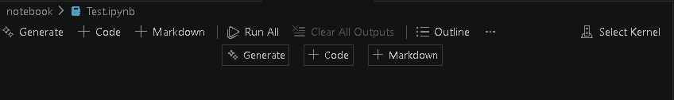
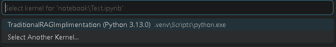

## ⚙️ How to Install & Set Up UV (Python)
```bash
https://docs.astral.sh/uv/getting-started/installation/#upgrading-uv
```

## ⚙️ Environment Setup Using UV

### 🧩 Step 1: Initialize UV
```bash
uv init          
```
### 🐍 Step 2: Create Virtual Environment  
```bash
uv venv
```
###  ▶️ Step 3: Activate Virtual Environment
 ```bash
 .venv\Scripts\activate
 ```

 ### 📦 Step 4: Create requirements.txt

 ```bash
 langchain
langchain-core
langchain-community
pypdf
pymupdf
sentence-transformers
faiss-cpu
chromadb
langchain-groq
python-dotenv
typesense
langchain-openai
langgraph
```
### 🚀 Step 5: Install the Packages

```bash
uv add -r requirements.txt
```
#### 📌 -r means "read from file"

## 📦 Managing Packages in UV

---

## 🔍 1. View Packages in the Current Environment

If you want to see the Python packages currently installed in your active virtual environment, use the **uv pip interface**:

### ✅ List all installed packages
```bash
uv pip list
```
#### 👉 Shows all installed packages with their versions.

### 🌳 View dependency tree
```bash
uv pip tree
```
#### 👉 Displays which packages depend on others (visual structure).

### 📄 Export packages (requirements format)

```bash
uv pip freeze
```
#### 👉 Outputs installed packages in requirements.txt format.

### 🌐 2. View Globally Installed Tools

#### 🧰 List global tools
```bash
uv tool list
```
#### 👉 Shows all globally installed tools via UV.

### ⚙️ 3. Advanced Filtering & Options

#### 📊 Output in JSON format
```bash
uv pip list --format json
```
#### 👉 Useful for automation or scripts.

### 🖥️ Check system Python packages (outside venv)
```bash
uv pip list --system
```
#### 👉 Lists packages installed in system Python instead of virtual environment.

### 🔎 Check details of a specific package
```bash
uv pip show numpy
```
#### 👉 Shows metadata like:

- Version
- Location
- Dependencies

---
---

## 📁 Project Setup

### 🧩 Create Required Folders

Inside your project directory, create the following folders:

- `data` → For storing datasets, documents, PDFs, etc.  
- `notebook` → For Jupyter Notebook files (`.ipynb`)  

---

### 📌 Example Structure
```bash 
project-root/
│
├── data/
├── notebook/document.ipynb
├── requirements.txt
└── main.py
```

## 📓 Working with Jupyter Notebook (UV Setup)

To use your UV virtual environment inside Jupyter Notebook, you need to install **ipykernel**.

---

## 🧩 Step 1: Install ipykernel

```bash
uv add ipykernel
```
## 📓 Selecting Kernel in Jupyter Notebook

### 🧩 Steps to Select Kernel

1. Once you create `document.ipynb`  
2. Click on **Select Kernel** (top right in notebook)



---

### 🔍 Choose Your Environment

- Search for your project environment (same name as your project)
- Select the correct kernel

---

### ⚠️ If Kernel is Not Showing

- Close **VS Code**
- Reopen it
- Try selecting the kernel again

---



---

### 🧾 One-Line Summary

> Select the correct kernel to ensure your notebook uses the right environment.